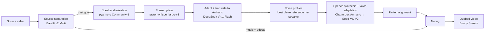

# Amharic Dubbing Pipeline

An open-source pipeline for dubbing movies into **Amharic** while preserving the
original music and sound effects. The soundtrack is split into dialogue, music,
and effects; the dialogue is transcribed, translated/adapted, re-voiced with
cloned voices, re-timed, and mixed back with the untouched music and effects.

> **Status: scaffold + separation + diarization + transcription + adaptation +
> voice profiles + speech synthesis.** This repository contains the project
> structure, the configuration system, the BandIt v2 Multi source-separation
> stage, the pyannote Community-1 speaker diarization stage, the faster-whisper
> transcription stage, the DeepSeek dialogue-adaptation stage, the per-speaker
> voice-profile stage, the Chatterbox Amharic + Seed-VC V2 speech-synthesis
> stage, and a health-check script. The remaining AI pipeline stages are
> placeholders that document their intended interfaces. See [Roadmap](#roadmap).

---

## Planned pipeline



## Tech stack

| Concern              | Choice                                  |
| -------------------- | --------------------------------------- |
| Language             | Python 3.12                             |
| Runtime              | RunPod A40 worker, NVIDIA CUDA 12.8     |
| Framework            | PyTorch 2.8 + torchaudio 2.8            |
| Media                | FFmpeg                                  |
| Source separation    | BandIt v2 Multi                         |
| Diarization          | pyannote Community-1                    |
| Transcription        | faster-whisper large-v3                 |
| Translation/adaptation | DeepSeek V4.1 Flash API               |
| Speech synthesis     | Chatterbox Multilingual v3 + gabar-tech Amharic adapter |
| Voice conversion     | Seed-VC V2                              |
| Delivery (later)     | Bunny Stream                            |

Target GPU: **NVIDIA RTX A40 (48 GB VRAM)**.

## Runtime environment

The pipeline runs on a RunPod A40 pod created from the **official RunPod PyTorch
image**. That image already provides the heavy parts of the stack:

| Provided by the worker image | Version   |
| ---------------------------- | --------- |
| Python                       | 3.12      |
| PyTorch                      | 2.8       |
| torchaudio                   | 2.8       |
| CUDA                         | 12.8      |
| FFmpeg                       | on `PATH` |

Because of that, this repository deliberately contains **no container or
deployment artifacts** (no Dockerfile, Compose file, or lockfile), and it does
not install or pin a CUDA/PyTorch stack of its own. Only the application's own
dependencies are installed, from `requirements.txt`.

## Project structure

```
amharic-dub/
  app/
    __init__.py
    config.py                 # environment-driven configuration (implemented)
    pipeline/                 # one module per stage
      __init__.py
      separation.py           # BandIt v2 Multi separation (implemented)
      diarization.py          # pyannote Community-1 diarization (implemented)
      transcription.py        # faster-whisper large-v3 transcription (implemented)
      translation.py          # DeepSeek Amharic dialogue adaptation (implemented)
      voice_profiles.py       # per-speaker voice references + clone-prompt cache (implemented)
      tts.py                  # Chatterbox Amharic + Seed-VC V2 synthesis (implemented)
      timing.py
      mixing.py
      video.py
    models/                   # shared model loading/caching (placeholder)
    audio/                    # audio IO + DSP helpers (placeholder)
    utils/                    # logging, subprocess, manifests (placeholder)
  tests/                      # pytest suite
  scripts/
    check_environment.py      # runtime health check (implemented)
  data/
    input/                    # source videos (not committed)
    working/                  # intermediate artifacts (not committed), including
                              #   voices/<SPEAKER_ID>/{reference.wav,voice_clone.pt,profile.json}
                              #   tts/{performance,chatterbox,converted,clips}/*.wav
    output/                   # final dubbed videos (not committed)
  .env.example
  .gitignore
  README.md
  pyproject.toml
  requirements.txt
```

## Configuration

All configuration comes from environment variables. A local `.env` file is
loaded when present but never overrides values already set in the real
environment, so values configured on the RunPod pod always win.

| Variable            | Purpose                                             | Default            |
| ------------------- | --------------------------------------------------- | ------------------ |
| `DEEPSEEK_API_KEY`  | DeepSeek dialogue adaptation/translation            | *(unset)*          |
| `HUGGINGFACE_TOKEN` | Download gated model weights (e.g. pyannote)        | *(unset)*          |
| `INPUT_DIR`         | Source videos                                       | `./data/input`     |
| `WORK_DIR`          | Intermediate artifacts                              | `./data/working`   |
| `OUTPUT_DIR`        | Final dubbed videos                                 | `./data/output`    |
| `MODEL_CACHE_DIR`   | Runtime model weight downloads                      | `./models_cache`   |
| `DIARIZATION_MODEL` | Hugging Face pipeline id for diarization            | `pyannote/speaker-diarization-community-1` |
| `TRANSCRIPTION_MODEL` | faster-whisper model for transcription            | `large-v3`         |
| `TRANSCRIPTION_COMPUTE_TYPE` | CTranslate2 compute type (`float16` on GPU) | `float16`          |
| `TRANSCRIPTION_LANGUAGE` | Source language code; unset detects it        | *(unset → detect)* |
| `TRANSLATION_BASE_URL` | DeepSeek API endpoint (OpenAI-compatible)        | `https://api.deepseek.com` |
| `TRANSLATION_MODEL` | DeepSeek model for dialogue adaptation            | `deepseek-flash`   |
| `TRANSLATION_BATCH_SIZE` | Dialogue lines adapted per request           | `10`               |
| `TRANSLATION_DISABLE_THINKING` | Turn off reasoning/thinking mode       | `true`             |
| `VOICE_PROFILE_DIR` | Per-speaker voice profiles directory                | `$WORK_DIR/voices` |
| `VOICE_REFERENCE_MIN_DURATION` | Shortest usable voice-cloning reference  | `3.0`              |
| `VOICE_REFERENCE_TARGET_DURATION` | Preferred reference length            | `10.0`             |
| `VOICE_REFERENCE_MAX_DURATION` | Longest reference kept (a longer continuous turn is scanned with a sliding window) | `15.0` |
| `DEVICE`            | `cuda` on a GPU worker, `cpu` for CPU-only checks   | `cuda`             |
| `LOG_LEVEL`         | `DEBUG` / `INFO` / `WARNING` / `ERROR`              | `INFO`             |

**Secrets are never hard-coded.** The project runs without any API keys, so you
can test and run the health check before configuring credentials.

```bash
cp .env.example .env   # then edit .env and fill in real values
```

## Quickstart - RunPod A40 worker

Start a Pod from the official RunPod PyTorch image, then:

```bash
pip install -r requirements.txt
python scripts/check_environment.py
```

`scripts/check_environment.py` reports the Python version, the PyTorch version,
CUDA availability, GPU name, available VRAM, and FFmpeg availability. It needs
no credentials and downloads nothing, so it is safe to run first.

Model weights (BandIt, pyannote, faster-whisper, Chatterbox, Seed-VC) are **not**
part of this repository. They are downloaded at runtime into `MODEL_CACHE_DIR`;
point that variable at the Pod's persistent volume so the weights survive
restarts. `app.pipeline.tts` snapshots the Chatterbox Amharic adapter and its
pinned base model into `MODEL_CACHE_DIR` itself; Seed-VC fetches its own
checkpoints and vocoder through Hugging Face, which takes no cache argument, so
export `HF_HOME=$MODEL_CACHE_DIR` in the worker environment as well.

The pyannote Community-1 diarization checkpoint is a **gated** Hugging Face
model, so `HUGGINGFACE_TOKEN` is required before running that stage. The token's
account must first accept the conditions on the
[model page](https://huggingface.co/pyannote/speaker-diarization-community-1).

Transcription uses faster-whisper `large-v3`, which is **not** gated and is
downloaded into `MODEL_CACHE_DIR` on first run. It defaults to `float16`, which
targets the A40 GPU; a CPU-only run needs
`TRANSCRIPTION_COMPUTE_TYPE=int8` because CTranslate2 does not support fp16 on
CPU. The pipeline never falls back from GPU to CPU on its own.

Dialogue adaptation calls the DeepSeek API, so `DEEPSEEK_API_KEY` is required
before running that stage. It is the only stage that needs network access to a
third party; every model that runs locally has its weights cached under
`MODEL_CACHE_DIR`.

Voice profiles are built from the **dialogue stem** produced by separation, never
from the full movie mix, so each reference is free of music and effects. For every
diarized speaker the stage scores that speaker's own continuous turns and keeps
the cleanest 3-10 second window, then cuts it to mono 24 kHz PCM WAV with FFmpeg
under `<VOICE_PROFILE_DIR>/<SPEAKER_ID>/reference.wav`. FFmpeg must therefore be
on `PATH`. Emotion, intensity and delivery are **not** stored in a profile: they
change per line and belong to `AdaptedDialogue`.

Candidate windows are ranked on duration, speech presence, dynamic range,
loudness, overlap with other speakers and clipping. Speech presence is an energy
VAD: a frame counts as speech only when it rises above the *local* noise floor, so
a loud music bed or steady bleed - which stays close to its own floor whatever its
level - is rejected rather than outranking quieter dialogue. When a transcript is
available it also contributes a modest orthographic phonetic-variety term; without
one the term is dropped instead of being guessed.

Speaker ids are kept exactly as diarization reported them, but only ever used as a
single sanitised directory component (`speaker_directory_name`), so an unusual or
hostile label cannot write outside `VOICE_PROFILE_DIR`.

Voice-clone prompts are cached next to each reference as `voice_clone.pt`. Encoding
is the expensive step, so an existing prompt is always reused and never
re-encoded; pass a `clone_encoder` callable to `build_voice_profiles` if your setup
needs a serialized prompt. The TTS stage does not need one: the Amharic adapter
takes reference audio directly, so `clone_prompt_path` may stay `None`.

### Speech synthesis (`tts.py`)

Two engines run per line, in this order:

1. **Chatterbox Amharic** (`gabar-tech/chatterbox-amharic`, a LoRA adapter plus a
   Fidel tokenizer on Chatterbox Multilingual v3) speaks the Amharic text. It is
   loaded through the loader the adapter repository ships
   (`amharic_tts.py` → `load_amharic_tts`), so training and inference see the
   same text front-end - including the Amharic normalization and sentence
   splitting.
2. **Seed-VC V2** converts that take into the character's identity with
   `convert_style=True`, which keeps the take's accent and emotion and replaces
   only the timbre. Seed-VC is not a package, so clone it and point
   `SEED_VC_REPO_PATH` at the checkout:
   `git clone https://github.com/Plachtaa/seed-vc <SEED_VC_REPO_PATH>`. Its V2
   converter is called as its own `inference_v2.py` calls it: a `torch.device`
   (it reads `device.type`) and `stream_output=True`, whose generator yields
   `(mp3_bytes, full_audio)` with the completed `(sample_rate, samples)` only on
   the final chunk.

The two references come from two different places on purpose. Chatterbox's prompt
decides *how* the line is performed, so it is the original actor's own audio for
that line, cut from the clean BandIt speech stem and centred on the line (padded
when the line is short, trimmed when it is long, bounded by
`TTS_PERFORMANCE_REFERENCE_MIN_DURATION` / `..._MAX_DURATION`).
`VoiceProfile.reference_audio` is used only as the Seed-VC target identity, which
is what makes a character sound like themselves across a film. A `VoiceProfile`
is never modified by this stage.

`AdaptedDialogue`'s performance metadata is mapped, not discarded. `intensity`
moves Chatterbox's `exaggeration` and `temperature` predictably; `emotion` and
`delivery` add a small bias from a cue table; `pause_before` and `pause_after` are
rendered as silence around the converted line, capped at `TTS_MAX_PAUSE_SECONDS`.
Every adjustment is bounded around the adapter's own validated defaults, is
recorded in `PerformanceControls` (with the matched cue terms and the notes that
explain each change), and an unknown emotion or delivery direction changes nothing
and says so rather than inventing a mapping.

Artifacts are deterministic and reusable, one file per line per step, under
`<WORK_DIR>/tts/`:

```
tts/
  performance/  <SPEAKER_ID>_<digest>.wav   # the original performance prompt
  chatterbox/   <SPEAKER_ID>_<digest>.wav   # the Amharic take
  converted/    <SPEAKER_ID>_<digest>.wav   # the same take in the character's voice
  clips/        <SPEAKER_ID>_<digest>.wav   # converted audio + rendered pauses
```

The digest covers the line's timing, text and performance metadata (plus a recipe
version), so the same input always produces the same paths, a changed line never
silently reuses a stale take, and re-running a stage skips work that is already
on disk.

Durations are reported, not fitted: `TtsClip` carries `speech_duration`, the
rendered pauses, the original window and `duration`, and never time-stretches
anything. Making each line fit its original window is `timing.py`'s job. Both
engines are lazy and cached per process (keyed by device/model and by
device/checkout/diffusion steps), so no model is loaded per dialogue line. The
Chatterbox adapter, its pinned base model and the loader file are snapshotted
into `MODEL_CACHE_DIR`; Seed-VC's own downloads follow `HF_HOME` (see
[Quickstart](#quickstart---runpod-a40-worker)).

### Configuration-only check (no GPU or API keys required)

The configuration layer and its tests run on any machine with Python 3.12:

```bash
pip install python-dotenv pytest
pytest tests/test_config.py
```

## Roadmap

- [x] Project scaffold, configuration, health check
- [x] `separation`: BandIt v2 Multi integration
- [x] `diarization`: pyannote Community-1 integration
- [x] `transcription`: faster-whisper large-v3 integration
- [x] `translation`: DeepSeek Amharic dialogue adaptation
- [x] `voice_profiles`: per-speaker voice references and clone-prompt cache
- [x] `tts`: Chatterbox Amharic synthesis + Seed-VC V2 voice adaptation
- [ ] `video`: FFmpeg extract/mux helpers
- [ ] `timing`: speaking-rate alignment
- [ ] `mixing`: dialogue + music + effects re-mix
- [ ] Orchestrator + pipeline entry point
- [ ] Bunny Stream upload/streaming integration
- [ ] (Later) production API + database

## Contributing

Contributions are welcome. Each pipeline stage lives in its own module under
`app/pipeline/` with a docstring describing its intended interface; please keep
that structure and add tests alongside new code.

## License

Open source. A license file will be added before the first release.
